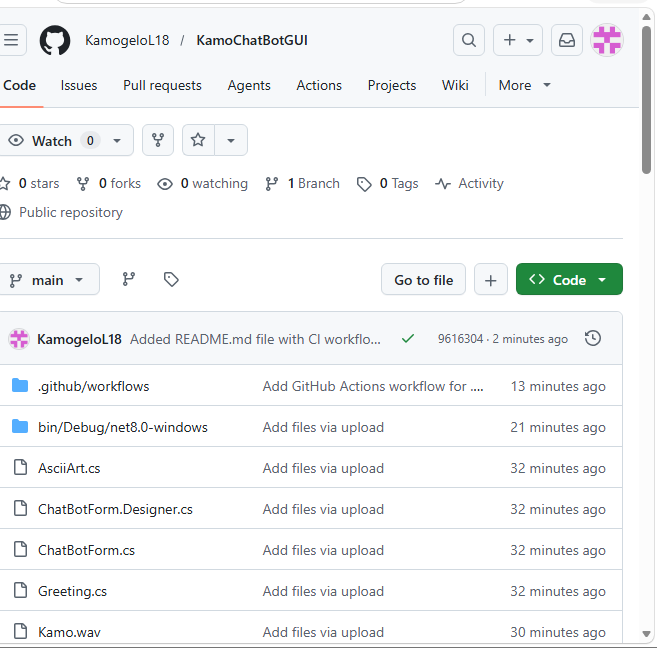

# Cybersecurity Awareness Chatbot - Part 2

## GitHub Actions CI

The build passes with no errors:

## Features

- GUI with Windows Forms
- Voice greeting on startup
- ASCII art logo
- WhatsApp style messages with timestamps
- Bot and user avatars (images)
- Keyword recognition (password, scam, privacy, 2FA)
- Random responses
- Conversation flow with "another tip"
- Memory to remember user name and interests
- Sentiment detection (worried, curious, frustrated)
- Error handling for invalid inputs

## How to Run

1. Open KamoChatBotGUI.sln in Visual Studio
2. Press F5 to run

## Requirements Met

- Minimum 6 commits
- GitHub Actions CI passing
- Release with tag v2.0